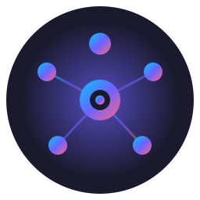

# ioBroker.govee-smart

Control all [Govee](https://www.govee.com/) WiFi products from ioBroker — lights, sensors and appliances. Bluetooth-only devices are not supported.

The adapter uses every channel Govee offers and picks whichever delivers the fastest, most reliable answer:
- **LAN** (UDP) — primary for lights with LAN mode enabled
- **AWS IoT MQTT** — real-time status push when you supply your Govee account
- **OpenAPI MQTT** — push events for sensors and appliances (lackWater, iceFull etc.)
- **Cloud REST v2** — capabilities, scenes, control fallback
- **App API** — sensor readings (Govee's OpenAPI v2 returns empty for thermometers, the App API doesn't)

The Wiki lists every supported model and its test status:
- [Devices (English)](https://github.com/krobipd/ioBroker.govee-smart/wiki/Devices)
- [Geräte (Deutsch)](https://github.com/krobipd/ioBroker.govee-smart/wiki/Geraete)

---

## Documentation

Full user documentation lives in the **[Wiki](https://github.com/krobipd/ioBroker.govee-smart/wiki)**.

| Topic | English | Deutsch |
|---|---|---|
| Landing page | [Home](https://github.com/krobipd/ioBroker.govee-smart/wiki/Home) | [Startseite](https://github.com/krobipd/ioBroker.govee-smart/wiki/Startseite) |
| Channels, credentials, API key, experimental devices | [Setup](https://github.com/krobipd/ioBroker.govee-smart/wiki/Setup) | [Einrichtung](https://github.com/krobipd/ioBroker.govee-smart/wiki/Einrichtung) |
| Supported models, status meanings, contributing yours | [Devices](https://github.com/krobipd/ioBroker.govee-smart/wiki/Devices) | [Geräte](https://github.com/krobipd/ioBroker.govee-smart/wiki/Geraete) |
| Thermometers, heaters, kettles, etc. — state tree, updates, troubleshooting | [Sensors and Appliances](https://github.com/krobipd/ioBroker.govee-smart/wiki/Sensors-and-Appliances) | [Sensoren und Appliances](https://github.com/krobipd/ioBroker.govee-smart/wiki/Sensoren-und-Appliances) |
| Lights — segment count, wizard, cut strips, batch commands | [Segments](https://github.com/krobipd/ioBroker.govee-smart/wiki/Segments) | [Segmente](https://github.com/krobipd/ioBroker.govee-smart/wiki/Segmente) |
| Lights — scene library, speed slider, Cloud vs local snapshots | [Scenes and Snapshots](https://github.com/krobipd/ioBroker.govee-smart/wiki/Scenes-and-Snapshots) | [Szenen und Snapshots](https://github.com/krobipd/ioBroker.govee-smart/wiki/Szenen-und-Snapshots) |
| Lights — group fan-out, capability intersection | [Groups](https://github.com/krobipd/ioBroker.govee-smart/wiki/Groups) | [Gruppen](https://github.com/krobipd/ioBroker.govee-smart/wiki/Gruppen) |
| Folder naming, startup, diagnostics, troubleshooting | [Behavior](https://github.com/krobipd/ioBroker.govee-smart/wiki/Behavior) | [Verhalten](https://github.com/krobipd/ioBroker.govee-smart/wiki/Verhalten) |

---

## Features

- **Capability-driven** — states are generated from what the Govee API reports for each device. No SKU hardcoding, no hand-maintained device list to fall behind.
- **LAN-first for lights** — UDP multicast discovery, sub-50 ms commands, status updates via AWS IoT MQTT
- **Cloud + MQTT push for sensors and appliances** — readings via the App API, events via the OpenAPI MQTT broker
- **Per-segment color and brightness** for LED strips with the right capability, including batch commands and an interactive segment detection wizard for cut strips
- **Scenes, DIY scenes, music mode, gradient toggle** — activated locally via BLE-over-LAN where possible, Cloud fallback otherwise
- **Cloud and local snapshots** — Govee-app snapshots and ioBroker-side snapshots side by side
- **Groups** — bridge Govee groups into ioBroker with capability intersection across members
- **Diagnostics export button per device** — one-click JSON dump for bug reports
- **Graceful degradation** — works LAN-only without any credentials; each tier unlocks more
- **Rate-limited Cloud usage** — daily and per-minute budgets aligned to Govee's quota

---

## Requirements

- Node.js >= 20
- ioBroker js-controller >= 7.0.0
- ioBroker Admin >= 7.6.20
- A Govee account and at least one Govee WiFi device. LAN control needs a light with LAN mode enabled in the Govee Home app — see Govee's [LAN-supported device list](https://app-h5.govee.com/user-manual/wlan-guide).

---

## Credential levels

| Level | Credentials | What works |
|-------|-------------|------------|
| **LAN only** | none | Lights with LAN mode: power, brightness, color, color temperature, local snapshots |
| **+ Cloud API key** | API key | + device names, capabilities, scenes, segments, Cloud snapshots, basic groups, sensor and appliance readings, push events for sensors/appliances |
| **+ Govee account** | email + password | + real-time status push for lights via AWS IoT MQTT, full group control |

Sensors and appliances always need at least the API key — they have no LAN protocol. See the [Setup page](https://github.com/krobipd/ioBroker.govee-smart/wiki/Setup) for how to get one.

---

## Ports

| Port | Protocol | Direction | Purpose |
|------|----------|-----------|---------|
| 4001 | UDP | Outbound (multicast 239.255.255.250) | LAN device discovery |
| 4002 | UDP | Inbound | LAN device responses |
| 4003 | UDP | Outbound | LAN device commands |

All ports are fixed by the Govee LAN protocol and cannot be changed.

---

## Troubleshooting

Common issues (no devices discovered, empty scenes dropdown, segment colors not changing, limited group commands, delayed status updates) are covered on the Wiki [Behavior](https://github.com/krobipd/ioBroker.govee-smart/wiki/Behavior) / [Verhalten](https://github.com/krobipd/ioBroker.govee-smart/wiki/Verhalten) page.

For anything else, press **`info.diagnostics_export`** on the affected device, copy the JSON from `info.diagnostics_result`, and open a [GitHub Issue](https://github.com/krobipd/ioBroker.govee-smart/issues).

---

## Acknowledgments

This adapter's MQTT authentication and BLE-over-LAN (ptReal) protocol implementation was informed by research from [govee2mqtt](https://github.com/wez/govee2mqtt) by Wez Furlong. Their reverse-engineering of the Govee AWS IoT MQTT protocol and undocumented API endpoints was invaluable.

---

## Changelog

### 2.0.0 (2026-04-26)
- Major release — Govee appliances and sensors are now handled by this adapter alongside lights. Govee thermometers (e.g. H5179), heaters, kettles, ice makers and more are imported through the App API (sensor states) and the OpenAPI-MQTT push channel (appliance events).
- The standalone `iobroker.govee-appliances` adapter is deprecated and rolls into here. The old adapter still runs but receives no further updates — install govee-smart 2.0.0+ and uninstall govee-appliances at your convenience.
- New checkbox **"Enable experimental device support"** in the adapter config makes it easier to try unconfirmed models. The Wiki page [Devices](https://github.com/krobipd/ioBroker.govee-smart/wiki/Devices) lists every supported SKU and its status (verified ✅ / user-confirmed 🟢 / experimental ⚪).
- Devices catalog (`devices.json` in the repo root) tracks 36 SKUs at release time; the catalog is the single source of truth for the Wiki page and for runtime quirk-overrides like the per-SKU color-temperature ranges that Govee's API misreports.
- New state `info.openapiMqttConnected` for the second MQTT channel that delivers appliance events. The existing `info.mqttConnected` keeps tracking AWS IoT MQTT for light status push.

### 1.11.0 (2026-04-25)
- Scene / DIY-scene / snapshot / music-mode dropdowns now accept three input forms from Blockly and JS scripts: the index as a string (`"1"`), the index as a number (`1`), or the entry name (`"Aurora"`, case-insensitive, surrounding whitespace ignored). The state type changed from `string` to `mixed` so the js-controller no longer warns `expects type string but received number` when a script writes a numeric index.
- Duplicate names from the cloud (Govee allows two scenes called "Movie") are now auto-disambiguated in the dropdown with `" (2)"`, `" (3)"` suffixes — the first occurrence keeps the original name, every label maps to exactly one index, and the reverse-lookup is deterministic.
- After activation the adapter acks back the canonical key so the dropdown stays in sync regardless of how the user wrote the value — `setState(oid, "Aurora")` ends up showing "Aurora" in the dropdown just like `setState(oid, "1")` does.

### 1.10.1 (2026-04-20)
- Fix — the `info.refresh_cloud_data` button was re-fetching every device's scene / music / DIY / SKU-features libraries on each click. Libraries never change for a given SKU, and several of those endpoints return 403 for many accounts, so running them again on every refresh only produced a multi-minute rate-limiter backlog — visible in the log as minute-spaced POSTs to `/device/scenes` and `/device/diy-scenes` in the minutes after each click. The button now only re-fetches the scene/snapshot endpoint, which is where new Govee-app snapshots actually show up. Call count per click drops from ~7 to 2 per light device.

### 1.10.0 (2026-04-20)
- Scenes with a `scenceParam` (the multi-packet A3 BLE payload that drives per-segment animation) are now skipped on devices without segments and activated via the Govee Cloud instead. Curtain Lights (H70B3) and bulbs silently drop those A3 packets, which left complex scenes unplayed; the simple presets without `scenceParam` kept working. With this fix every scene reaches the device, at the cost of one Cloud call per scene change on non-segmented hardware.
- Powering a device off now resets every mode dropdown (scene, DIY scene, Cloud/local snapshot, music) to "---", whether the off was triggered from ioBroker or from the Govee Home app. A device that is off cannot be "playing Aurora-A" — the UI now reflects that.

### 1.9.1 (2026-04-20)
- Hotfix — Govee's `/device/scenes` endpoint occasionally returns e.g. 149 scenes + 0 snapshots on the same device where a snapshot clearly exists. The old combined guard (`if any of the three lists is non-empty, overwrite all three`) wiped the snapshot list in that case, and the cloud-snapshot dropdown then errored out with `invalid snapshot index 1` on click. Each of scenes, DIY scenes and snapshots is now guarded independently — a lucky list no longer clobbers an unlucky one. Applies to every device with cloud-side snapshots, not just the device where it first surfaced.

### 1.9.0 (2026-04-20)
- **BREAKING** — the cloud-snapshot dropdown has been renamed from `snapshots.snapshot` to `snapshots.snapshot_cloud`. The new id is unambiguous next to `snapshots.snapshot_local`, `snapshots.snapshot_save` and `snapshots.snapshot_delete`. If your scripts or VIS widgets reference the old id, update them to the new one. The old state is simply removed on first start — nothing is migrated because the value (a dropdown index) is set again on the next selection anyway.
- Fix — scenes and snapshots are now re-fetched from the Govee Cloud on every adapter start. Previously, once `scenesChecked` was set on the cache, the adapter skipped the Cloud round-trip even when you had created a new snapshot in the Govee Home app, so new snapshots only appeared after wiping the cache. This was a genuine bug. Scene data is essentially static, but snapshots are user content — refreshing is cheap (one call per light device per startup) and much less surprising.
- New — `info.refresh_cloud_data` button at adapter level. Write `true` to trigger the same fresh fetch without restarting the adapter. Useful when you just created a snapshot in the Govee Home app and want to pick it in ioBroker right now.
- All four snapshot states (`snapshot_cloud`, `snapshot_local`, `snapshot_save`, `snapshot_delete`) now carry a `common.desc` text that makes it clear in the object browser which is the Govee-app kind and which is the ioBroker kind.

### 1.8.0 (2026-04-20)
- Performance — `updateDeviceState` now fires every status write in parallel and drops the per-write object-existence probe; MQTT status pushes cost a fraction of what they used to on large device lists
- Performance — `cleanupAllChannelStates` replaces its four per-device view queries with one broader view; device-list refresh scales with device count instead of 4 × device count
- Performance — `handleSnapshotSave` reads device + per-segment state in parallel; saving a snapshot on a 20-segment strip no longer blocks on 40 sequential reads
- Rate-limiter daily reset aligned to UTC midnight so the adapter's budget flips at the same instant Govee does — no more wasted quota when the adapter was started after midnight
- Local snapshots now write with `fsync`, matching the SKU cache — SIGKILL during adapter stop no longer silently drops a just-saved snapshot
- Library fetches (scene / music / DIY / SKU features) now go through the rate-limiter so a fresh install with many devices doesn't burst-call the undocumented `app2.govee.com` endpoints
- Wizard text fully localised (EN / DE) and resolved against the Admin UI language from `system.config`; English is the fallback for other admin languages
- govee-appliances coexistence covers every instance (`.0`, `.1`, …) not just `.0` — the shared-budget halving trips for any active sibling
- MQTT client keeps a stable per-process session UUID across reconnects; AWS IoT can now take over cleanly from a lingering socket instead of refusing a new connection
- Memory leak prevention — every adapter-level map (diagnostics throttle, state-channel map, device map) is now reaped when a device is removed so long-lived instances stay bounded
- Internal — shared `govee-constants.ts` for Govee app-impersonation headers, `stateToCommand` collapsed to a lookup table, `crypto.randomUUID` replaces the legacy Math.random UUID, unused `total` parameter dropped from `flashSingleSegment`

Older entries have been moved to [CHANGELOG_OLD.md](CHANGELOG_OLD.md).

---

## Support

- [Wiki](https://github.com/krobipd/ioBroker.govee-smart/wiki) — user documentation (EN / DE)
- [GitHub Issues](https://github.com/krobipd/ioBroker.govee-smart/issues) — bug reports, feature requests
- [ioBroker Forum](https://forum.iobroker.net/) — general questions

### Support Development

This adapter is free and open source. If you find it useful, consider buying me a coffee:

---

## License

MIT License

Copyright (c) 2026 krobi <krobi@power-dreams.com>

Permission is hereby granted, free of charge, to any person obtaining a copy
of this software and associated documentation files (the "Software"), to deal
in the Software without restriction, including without limitation the rights
to use, copy, modify, merge, publish, distribute, sublicense, and/or sell
copies of the Software, and to permit persons to whom the Software is
furnished to do so, subject to the following conditions:

The above copyright notice and this permission notice shall be included in all
copies or substantial portions of the Software.

THE SOFTWARE IS PROVIDED "AS IS", WITHOUT WARRANTY OF ANY KIND, EXPRESS OR
IMPLIED, INCLUDING BUT NOT LIMITED TO THE WARRANTIES OF MERCHANTABILITY,
FITNESS FOR A PARTICULAR PURPOSE AND NONINFRINGEMENT. IN NO EVENT SHALL THE
AUTHORS OR COPYRIGHT HOLDERS BE LIABLE FOR ANY CLAIM, DAMAGES OR OTHER
LIABILITY, WHETHER IN AN ACTION OF CONTRACT, TORT OR OTHERWISE, ARISING FROM,
OUT OF OR IN CONNECTION WITH THE SOFTWARE OR THE USE OR OTHER DEALINGS IN THE
SOFTWARE.

---

*Developed with assistance from Claude.ai*
